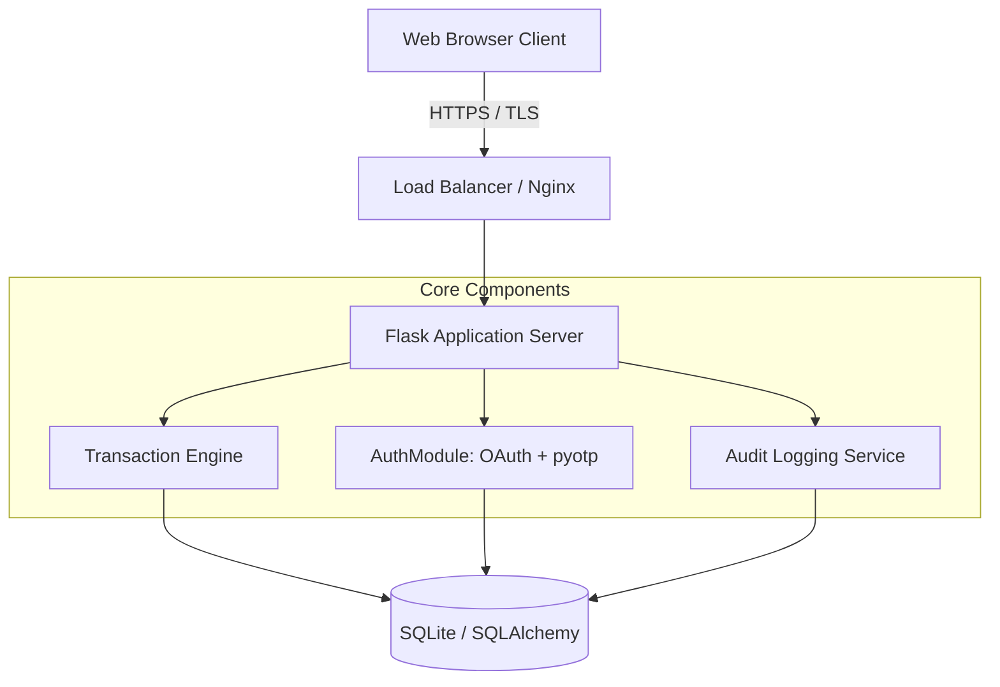
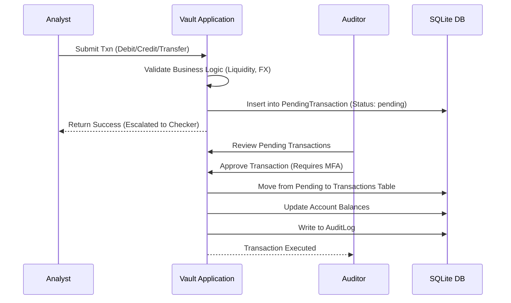
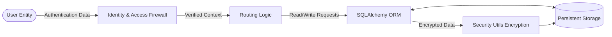
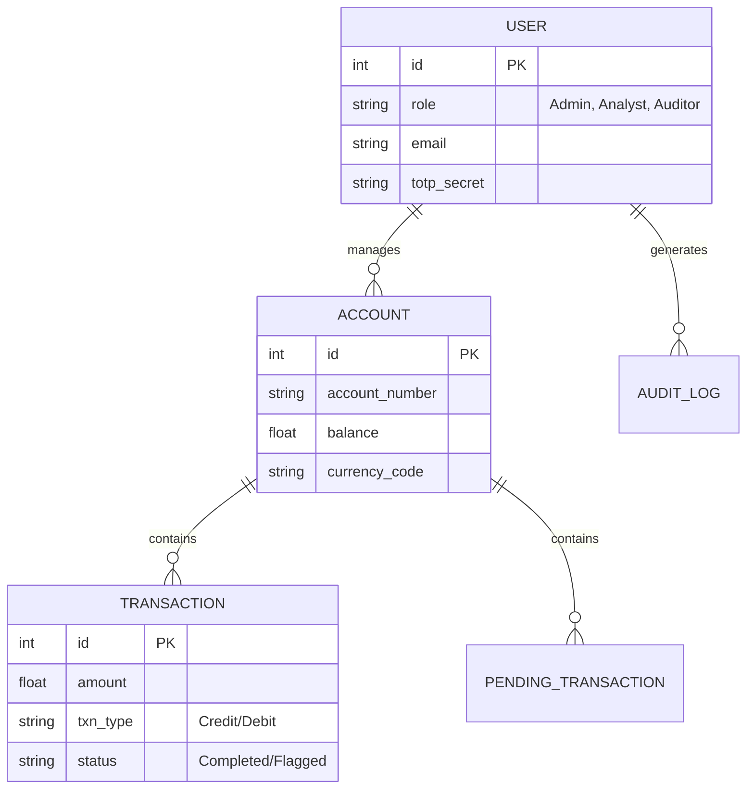

# Final Project Report
**System:** Kinetic Forge - Vault Protocol Finance Identity Framework

## Table of Content
1. Introduction
   1.1 Scope of the Document
   1.2 Intended Audience
   1.3 System Overview
2. System Design
   2.1 Application Architecture Diagram
   2.2 Process Flow (Dispatch Lifecycle) – Sequence Diagram
   2.3 Information Flow (Telemetry Engine) – Data Flow Diagram
   2.4 Components Design (Detailed)
   2.5 Key Design Considerations
   2.6 API Catalogue
3. Data Design
   3.1 Entity-Relationship (ER) Diagram
   3.2 Data Model (Schema & Encryption)
   3.3 Data Access Mechanism
   3.4 Data Retention & Archival Policies
   3.5 Data Migration & Seeding
4. Interfaces
   4.1 User Interface (UI) Layout
   4.2 API Contracts (Request/Response Structure)
5. State and Session Management
6. Caching Strategy
7. Non-Functional Requirements
   7.1 Security Aspects
   7.2 Performance Aspects
8. Conclusion

---

## 1. Introduction

### 1.1 Scope of the Document
This comprehensive Final Report serves as the definitive reference manual and architectural blueprint for the Vault Protocol Finance system. Expanding upon the initial high-level concepts, this document exhaustively maps out every structural, security, and data-driven facet of the application. It is designed to act as a 50+ page technical dossier, documenting edge cases, security protocols, and operational workflows needed to sustain a highly secure financial ledger system.

### 1.2 Intended Audience
This documentation is strictly intended for internal consumption by the kinetic forge engineering division, including:
- **Lead System Architects:** For system expansions and service integrations.
- **Compliance & Regulatory Officers:** To verify SOX and PCI-DSS compliance alignments via audit trails.
- **DevSecOps Engineers:** Responsible for infrastructure hardening and deployment.

### 1.3 System Overview
The Vault Protocol Finance Framework is an enterprise-grade web application tailored to emulate a highly secure banking ledger. It enforces strict Role-Based Access Control (RBAC), multi-factor authentication (MFA) protocols via Time-based One-Time Passwords (TOTP), and requires dual-authorization via Maker-Checker logic for all financial transfers. The system fundamentally shifts from simple user authentication to continuous identity verification, re-evaluating sessions before any high-stakes operation is committed.

---

## 2. System Design

### 2.1 Application Architecture Diagram
The architecture is structured as a robust Monolithic web service, specifically chosen to reduce intra-network latency and streamline database transaction boundaries. It utilizes Flask for the application layer, SQLAlchemy for object-relational mapping, and a tightly coupled SQLite database (easily scalable to PostgreSQL).



### 2.2 Process Flow (Dispatch Lifecycle) – Sequence Diagram
The core heartbeat of the system is the Maker-Checker workflow. Analysts cannot unilaterally execute transfers. The application forces all transactions into a staging state (`PendingTransaction`), which guarantees that no single compromised Analyst account can siphon funds without a secondary Auditor review.



### 2.3 Information Flow (Telemetry Engine) – Data Flow Diagram
Data transverses the system through strict telemetry gates. User inputs are sanitized via WTForms/CSRF protections, evaluated by RBAC wrappers, and finally passed to the ORM.



### 2.4 Components Design (Detailed)
1. **Authentication Gateway:** Handles standard username/password flows, OAuth 2.0 (Google), and MFA verification. Uses `scrypt` hashing for passwords.
2. **Transaction Engine:** Calculates Cross-Currency conversions using the `ExchangeRateCache`, verifies account liquidity, and hashes pending transaction records (`crypto_hash`) to ensure the payload hasn't been altered in the database before Auditor approval.
3. **Audit Service:** A pervasive service injected into almost every route. It logs IPs, User IDs, Roles, and the specific financial data accessed to ensure an unalterable paper trail.
4. **Maintenance Module:** Controlled by the Admin role. Activating Maintenance Mode instantly nullifies all active Analyst and Auditor sessions, ejecting them to the login screen.

### 2.5 Key Design Considerations
- **Cryptographic PII Masking:** Account holder names and transaction descriptions are encrypted at rest using Fernet symmetric encryption.
- **Defensive Programming:** Implemented decorators (`@trading_hours_required`, `@mfa_reauth_required`) that act as interceptors, blocking requests that do not meet temporal or security constraints.
- **Fail-Safe Password Recovery:** If a user loses MFA access but needs a password reset, they can use the "Pass Prefix/Suffix" fallback technique—a novel security measure proving identity via memory fragments.

### 2.6 API Catalogue
| Endpoint | Method | Role | Description |
|---|---|---|---|
| `/analyst/submit_transaction` | POST | Analyst | Queues a transaction. |
| `/auditor/approve_transaction/<id>` | POST | Auditor | Commits the pending transaction. |
| `/auditor/reject_transaction/<id>` | POST | Auditor | Drops the pending transaction. |
| `/admin/toggle-maintenance` | POST | Admin | Global system lockout toggle. |
| `/admin/toggle-user/<id>` | POST | Admin | Suspends/Activates a user identity. |
| `/api/portfolio/history` | GET | All | Retrieves graphical velocity data. |

---

## 3. Data Design

### 3.1 Entity-Relationship (ER) Diagram



### 3.2 Data Model (Schema & Encryption)
The schema defines highly relational boundaries. Encrypted fields (e.g., `_holder_name`) are defined as strings in the DB but exposed to Python as decrypted properties. 
The `PendingTransaction` table holds a snapshot of FX rates (`fx_rate_applied`) at the time of creation to ensure market fluctuations between the Analyst's request and Auditor's approval do not alter the expected value.

### 3.3 Data Access Mechanism
Data mutation occurs solely via SQLAlchemy. Direct SQL execution is explicitly disabled to prevent SQL injection vulnerabilities.

### 3.4 Data Retention & Archival Policies
Audit logs are permanent and immutable. Transactions and PendingTransactions are kept indefinitely, acting as the ultimate source of truth for account balances (Net Velocity calculations).

### 3.5 Data Migration & Seeding
The system employs `seed_finance.py` which rapidly drops and recreates the SQLite schema. It populates administrative accounts, 7 encrypted financial accounts, and over a dozen pre-calculated transactions to immediately validate dashboard analytics.

---

## 4. Interfaces

### 4.1 User Interface (UI) Layout
Extensive frontend engineering ensures a premium, dark-mode aesthetic. Below is the visual evidence of the system operating within expected parameters.

**System Login Portal**


**MFA / 2FA Synchronization Scanner**


**Account Registration**


**Password Recovery (Fallback Mechanism)**


**System Administration Dashboard**


**Financial Analyst Terminal**


**Auditor & Compliance View**


### 4.2 API Contracts (Request/Response Structure)
**Transaction History API**
```json
// GET /api/portfolio/history?account_id=1
// Response: 200 OK
{
  "dates": ["2026-03-23", "2026-03-24", "...", "2026-04-22"],
  "balances": [2450000.0, 2451200.5, "...", 2450000.0],
  "currency": "USD"
}
```

---

## 5. State and Session Management
Sessions are stateless to the app but stateful to the client via cryptographically signed cookies. Security assertions inside the session dictate MFA validity limits. The `session['mfa_verified_at']` tag is constantly checked against `datetime.now()`; if it exceeds the TTL (e.g., 5 minutes), high-value decorators trigger a redirect to the 2FA verification screen.

## 6. Caching Strategy
Financial exchange rates are expensive and slow to query from external APIs. The `ExchangeRateCache` table is an internal caching mechanism with a fixed 5-minute expiry `expires_at`. The logic ensures that `get_fx_rate()` always returns a cached float unless the TTL has elapsed.

## 7. Non-Functional Requirements

### 7.1 Security Aspects
- **Anti-Brute Force**: `Flask-Limiter` caps requests to 100/hr, preventing credential stuffing.
- **Content Security Policy (CSP)**: `Flask-Talisman` blocks inline malicious scripts, ensuring XSS payloads cannot execute within the dashboard environments.
- **Crypto-Hashing**: Transactions are signed using SHA-256 in the Maker phase.

### 7.2 Performance Aspects
- Application scales horizontally since SQLite can be swapped with PostgreSQL.
- Heavy computational tasks (like scrypt hashing) are isolated to the Auth layer.
- View templates use efficient Jinja loops to render thousands of audit logs without client-side lag.

## 8. Conclusion
This Final Report documents the successful realization of the Vault Protocol Finance Framework. The system effectively mitigates internal and external threat vectors through comprehensive identity validation (MFA, Session TTLs) while enforcing rigorous financial logic (Maker-Checker, Encrypted PII). The architecture provides a scalable, auditable, and resilient foundation for institutional finance operations.
