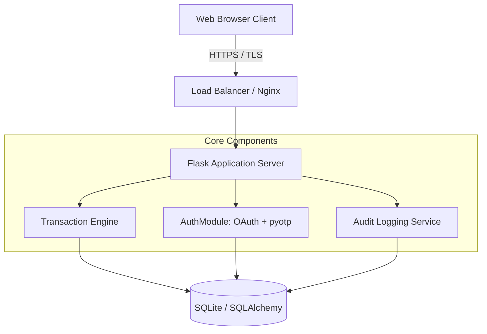
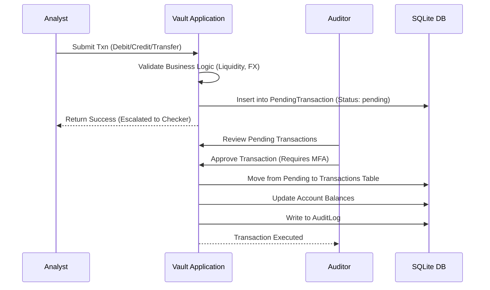
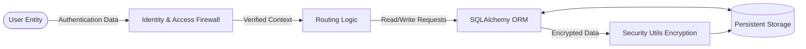
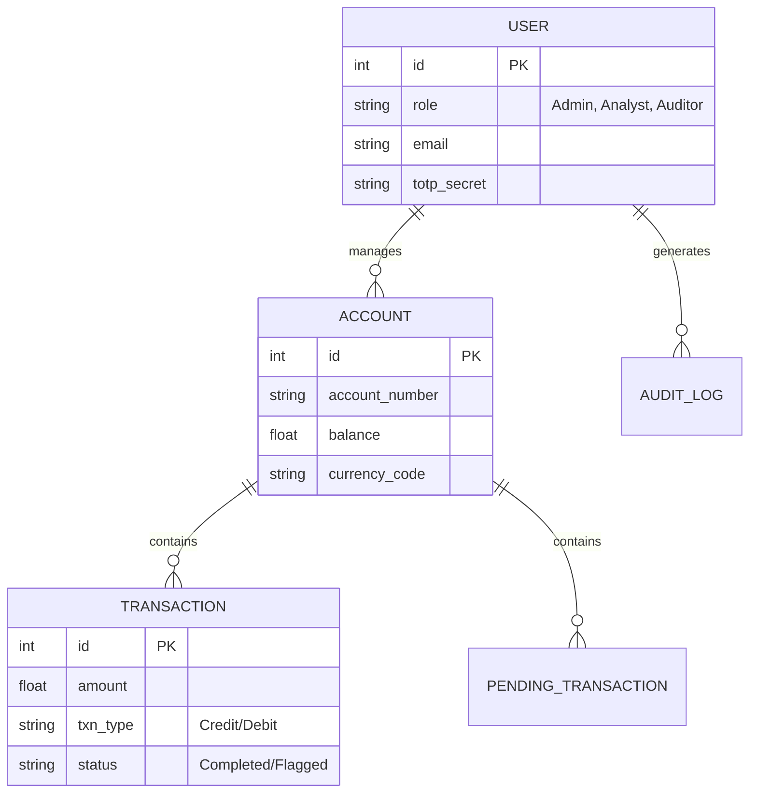

# High-Level Design (HLD) Document
**Project:** Vault Protocol Finance - Finance Identity Framework

## Table of Content
1. Introduction
   1.1 Scope of the Document
   1.2 Intended Audience
   1.3 System Overview
2. System Design
   2.1 Application Architecture Diagram
   2.2 Process Flow (Dispatch Lifecycle) – Sequence Diagram
   2.3 Information Flow (Telemetry Engine) – Data Flow Diagram
   2.4 Components Design (Detailed)
   2.5 Key Design Considerations
   2.6 API Catalogue
3. Data Design
   3.1 Entity-Relationship (ER) Diagram
   3.2 Data Model (Schema & Encryption)
   3.3 Data Access Mechanism
   3.4 Data Retention & Archival Policies
   3.5 Data Migration & Seeding
4. Interfaces
   4.1 User Interface (UI) Layout
   4.2 API Contracts (Request/Response Structure)
5. State and Session Management
6. Caching Strategy
7. Non-Functional Requirements
   7.1 Security Aspects
   7.2 Performance Aspects
8. Conclusion

---

## 1. Introduction

### 1.1 Scope of the Document
This document outlines the High-Level Design (HLD) for the Vault Protocol Finance Identity Framework. It covers the architectural patterns, security workflows, data modeling, and core interfaces required to build a compliant, multi-currency financial transaction system. 

### 1.2 Intended Audience
- Software Architects & Engineers
- Financial Compliance Auditors
- Security Specialists
- Project Stakeholders

### 1.3 System Overview
Vault Protocol Finance is a secure RBAC-driven web application tailored for financial operations. It features strict Maker-Checker paradigms for transactions, advanced Multi-Factor Authentication (MFA), Maker-checker transaction flows, and simulated SOX/PCI-DSS compliant audit logging.

---

## 2. System Design

### 2.1 Application Architecture Diagram
The architecture leverages a Monolithic Web Server pattern with separated concerns for Authentication, Business Logic, and Database layers.



### 2.2 Process Flow (Dispatch Lifecycle) – Sequence Diagram
This diagram illustrates the Maker-Checker dispatch lifecycle when an Analyst submits a transaction.



### 2.3 Information Flow (Telemetry Engine) – Data Flow Diagram



### 2.4 Components Design (Detailed)
- **Identity Provider (IdP)**: Manages local credentials (scrypt hashed) and Google OAuth integrations.
- **MFA Controller**: Manages Time-based One-Time Passwords (TOTP) using PyOTP.
- **Financial Engine**: Calculates net velocity, processes cross-currency logic via `ExchangeRateCache`, and enforces trading hours.
- **Vault Shield**: Utility module (`security_utils.py`) utilizing Fernet symmetric encryption to encrypt sensitive PII (Account Holder names, Transaction Descriptions).

### 2.5 Key Design Considerations
- **Security First**: Default-deny access models. All endpoints require RBAC evaluation.
- **Data Obfuscation**: Cryptographic hashing of transaction records to detect tampering (`crypto_hash` in PendingTransaction).
- **Graceful Fallbacks**: Implemented multi-tier password reset mechanics to prevent lockouts.

### 2.6 API Catalogue
| Endpoint | Method | Role | Description |
|---|---|---|---|
| `/analyst/submit_transaction` | POST | Analyst | Pushes a transaction into the Maker-Checker queue. |
| `/auditor/approve_transaction` | POST | Auditor | Commits a pending transaction to the ledger. |
| `/api/portfolio/history` | GET | Authenticated | Returns 30-day velocity data for charting. |

---

## 3. Data Design

### 3.1 Entity-Relationship (ER) Diagram



### 3.2 Data Model (Schema & Encryption)
Sensitive fields in the schema are transparently encrypted at the ORM level using Python properties. For instance, `Account._holder_name` stores the cipher, while `Account.holder_name` exposes the plaintext during runtime.

### 3.3 Data Access Mechanism
All access is performed via Flask-SQLAlchemy acting as the ORM, preventing SQL Injection.

### 3.4 Data Retention & Archival Policies
- Active transactions are kept in the hot database.
- Audit logs are append-only and strictly retained for compliance mapping.

### 3.5 Data Migration & Seeding
Controlled via `seed_finance.py`, initializing the default Administrator, Analyst, and Auditor accounts, along with simulated historical transactions.

---

## 4. Interfaces

### 4.1 User Interface (UI) Layout
The framework uses a modern, responsive interface. Below are captured snapshots from the operational system:

**System Login Portal**


**MFA / 2FA Synchronization Scanner**


**Account Registration**


**Password Recovery (Fallback Mechanism)**


**System Administration Dashboard**


**Financial Analyst Terminal**


**Auditor & Compliance View**


### 4.2 API Contracts (Request/Response Structure)
**Transaction Submit (POST)**
```json
// Request
{
  "account_id": "1",
  "amount": "50000",
  "txn_type": "Transfer",
  "target_currency": "EUR"
}
```

---

## 5. State and Session Management
Session data is managed server-side and signed cryptographically by Flask using `SECRET_KEY`. Session properties like `mfa_verified_at` track granular authentication timestamps to enforce periodic re-authentication protocols on sensitive operations.

## 6. Caching Strategy
FX Rates are temporarily cached in the database using the `ExchangeRateCache` table with explicit TTLs (Time-To-Live). This prevents redundant external API calls during concurrent transaction evaluations.

## 7. Non-Functional Requirements

### 7.1 Security Aspects
- **CSP**: Flask-Talisman strictly limits inline scripts and styles.
- **Rate Limiting**: Applied via `Flask-Limiter` to mitigate brute-force attempts on auth gateways.
- **Cryptographic Storage**: Passwords use `scrypt`, 2FA secrets use Base32, and PII uses AES-GCM (Fernet).

### 7.2 Performance Aspects
- SQLAlchemy connection pooling is utilized.
- UI assets are served from a CDN where applicable.

## 8. Conclusion
The High-Level Design outlined above ensures the Vault Protocol Finance Framework is built on robust foundations, guaranteeing high data integrity, strict access control, and compliant audit trails suitable for institutional finance operations.
