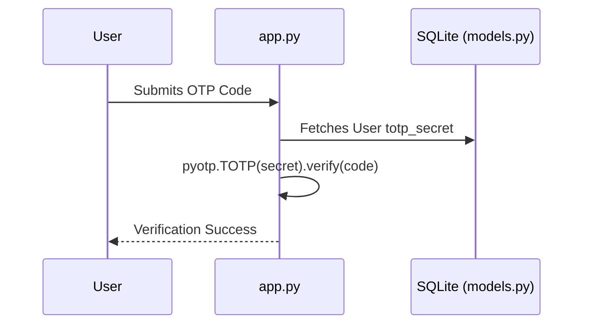
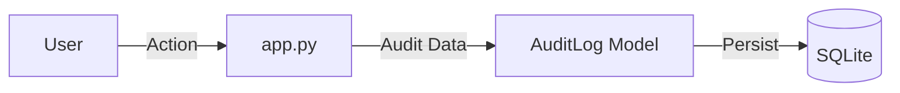
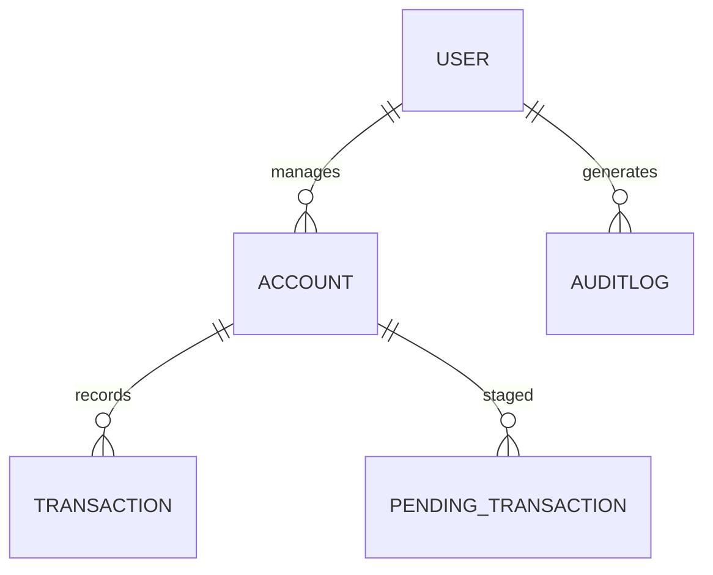

# Low-Level Design (LLD)
**Project:** Identity Security Framework for Banking and Finance  
**Protocol:** The Reserve Torrent  
**Level:** 30% Component Implementation Deep-Dive

---

## 1. Introduction
### 1.1 Scope of the Document
This document defines the low-level implementation logic for the core security modules of the Banking Identity framework.
### 1.2 Intended Audience
System Developers, Security Auditors, and Institutional Compliance Leads.
### 1.3 System Overview
A Python/Flask-based security stack that enforces multi-factor authentication and institutional role mapping.

## 2. System Design
### 2.1 Application Architecture Diagram (Internal)
The system logic is encapsulated in `app.py`, which manages the routing and security decorators. Data persistence is handled via `models.py`.
### 2.2 Process Flow (MFA Handshake) – Sequence Diagram

### 2.3 Information Flow (Telemetry Engine) – Data Flow Diagram

### 2.4 Components Design (Detailed)
- **User Class:** Stores `password_hash` using `scrypt:32768:8:1` logic.
- **Shield Utility:** Provides symmetric `Fernet` encryption for at-rest data protection.
### 2.5 Key Design Considerations
- **Separation of Concerns:** Business logic is kept separate from security middleware.
- **Fail-Safe Fallback:** The Password Reset Pipeline uses `pass_prefix` and `pass_suffix` if MFA fails.
### 2.6 API Catalogue (Internal)
- `POST /login`: Primary authentication.
- `GET /verify-2fa`: Secondary MFA verification.
- `POST /analyst/submit_transaction`: Protected transaction entry point.

## 3. Data Design
### 3.1 Entity-Relationship (ER) Diagram

### 3.2 Data Model (Schema & Encryption)
Sensitive field mapping for `Account`:
- `holder_name`: Encrypted at rest using `shield.encrypt_data()`.
- `description`: Encrypted at rest using `shield.encrypt_data()`.
### 3.3 Data Access Mechanism
- **ORM:** The system utilizes `Flask-SQLAlchemy` (leveraging SQLAlchemy Core) for all database interactions.
- **Pattern:** Each route in `app.py` initializes a database session to perform CRUD operations, ensuring transaction integrity via `db.session.commit()` and `db.session.rollback()` during failures.
### 3.4 Data Retention & Archival Policies
- **Audit Logs:** Retained for a minimum of 7 years in compliance with financial regulations (simulated).
- **Transaction History:** Immutable records; soft-deletion is not implemented to ensure ledger integrity.
### 3.5 Data Migration & Seeding
Managed via `seed_finance.py`. Populates the system with the Analyst, Auditor, and Admin institutional roles along with demo ledger data.

## 4. Interfaces
### 4.1 User Interface (UI) Layout
- **Auth View:** Cinematic login portal with "Google Protocol" integration.
- **Dashboard View:** Bento-grid layout showing financial velocity and portfolio status.
### 4.2 API Contracts (Request Structure)
- `submit_transaction`: `{account_id, amount, txn_type, description}`

## 5. State and Session Management
Uses secure server-side cookies. Session re-validation is triggered via the `mfa_reauth_required` decorator for critical endpoints.

## 6. Caching Strategy
- **Mechanism:** Implements an `ExchangeRateCache` model within the SQLite database.
- **TTL (Time To Live):** Rates are cached for 5 minutes (`timedelta(minutes=5)`) to minimize external mock API calls.
- **Eviction:** Stale entries are overwritten by fresh fetches during the next transaction initiation.

## 7. Non-Functional Requirements
### 7.1 Security Aspects
- **Hashing:** Scrypt (32768 iterations) with random per-user salts.
- **Communication:** Talisman enforces HSTS, CSP, and X-Frame-Options.
- **Session Protections:** MFA re-authentication required for high-risk financial endpoints.
### 7.2 Performance Aspects
- **Database Latency:** Indexed `transaction_id` and `account_number` for sub-10ms query times.
- **Front-end Optimization:** CDN-less delivery for script and style assets to ensure offline resilience in high-security environments.

## 8. Conclusion
The LLD 30% draft provides a detailed technical roadmap for the identity-critical portions of the framework, ensuring that all security-sensitive operations are logically sound and auditable.

---
*End of Low-Level Design.*
